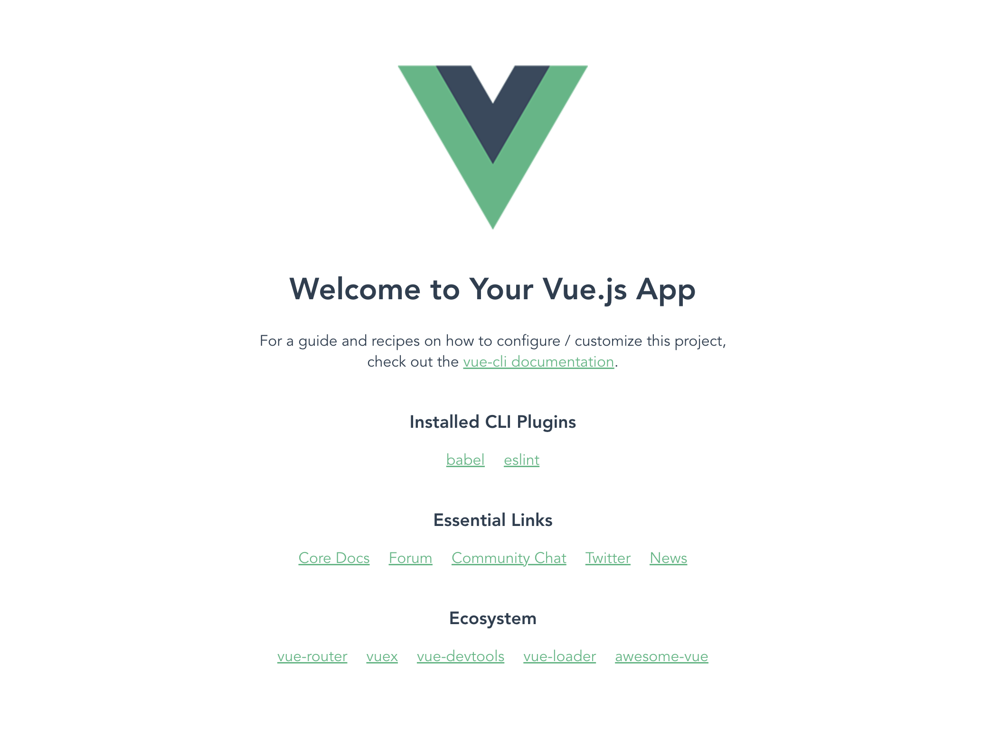
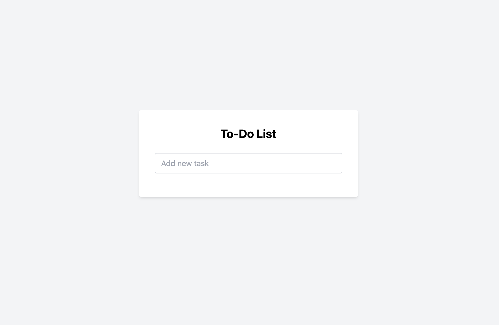

# Testing Vue with Cypress (Part 1: Setup a To-Do List App)

This is a step-by-step guide to use **Vue.js** to set up a To-Do List application and then test it with **Cypress**.

In this part we will create our Vue.js app. This app is a simple To-Do List application, which we will then
test in part 2.

## Step 0: Prerequisites
- **Node.js** and **NPM** installed on your system. You can download and install it from [here](https://nodejs.org/).

## Step 1: Set up the Project using Vue CLI

1. **Install Vue CLI globally** if you haven't already:
   ```bash
   npm install -g @vue/cli
   ```

2. **Create a new Vue project**:
   ```bash
   vue create cypress-tutorial
   ```

    - You will be prompted to pick a preset. Choose the default preset `Default ([Vue 3] babel, eslint)` by pressing Enter.
    - If prompted, choose NPM as a package manager.


3. **Navigate to your project folder**:
   ```bash
   cd cypress-tutorial
   ```

4. **Run the project** to make sure it's working:
   ```bash
   npm run serve -- --port 3000
   ```

   Your Vue project will now be running at `http://localhost:3000`.

   


#### Troubleshooting

- **Port Blocked**:
  - The default port (8080) for npm run serve can sometimes be blocked. We are specifying an alternative port like this:
    ```bash
    npm run serve -- --port 3000
    ```
  - If you need to use another port, just change 3000 to a port that is open on your computer.

### Step 2: Install TailwindCSS

Now, let's add **TailwindCSS** to the project.
Open a new terminal window or stop running the app using `Ctrl-C`. 

1. **Install TailwindCSS and PostCSS**:
   
   At the root of the `cypress-tutorial` folder, run the following command.

   ```bash
   npm install -D tailwindcss@latest postcss@latest autoprefixer@latest
   ```

2. **Create a Tailwind configuration file**:
   ```bash
   npx tailwindcss init
   ```

   This will generate a `tailwind.config.js` file in the root of your project.


3. **Configure Tailwind** to remove unused styles in production:

   Open the `tailwind.config.js` file and update it as follows:
   ```javascript
   /** @type {import('tailwindcss').Config} */
   module.exports = {
     content: [
       "./index.html",
       "./src/**/*.{vue,js,ts,jsx,tsx}",
     ],
     theme: {
       extend: {},
     },
     plugins: [],
   }
   ```

4. **Add Tailwind to your CSS**:

   - Create a `src/assets/main.css` file.
       ```bash
       touch src/assets/main.css
       ```   

   - Add the following Tailwind directives to that file:

       ```css
       @tailwind base;
       @tailwind components;
       @tailwind utilities;
       ```

5. **Import `main.css` in your `src/main.js` file**:

   As shown in line 3 below of `src/main.js`, ensure that you import the `main.css` file to load Tailwind CSS:

   ```javascript
   import { createApp } from 'vue'
   import App from './App.vue'
   import './assets/main.css'

   createApp(App).mount('#app')
   ```


6. **Configure PostCSS**:

   Tailwind requires PostCSS to process its styles. The PostCSS configuration can be done by creating a `postcss.config.js` file at the root of your project.

   - Create the `postcss.config.js` file if it doesn’t already exist:

      ```bash
      touch postcss.config.js
      ```

   - Add the following content to the `postcss.config.js` file:

     ```javascript
     module.exports = {
       plugins: {
         tailwindcss: {},
         autoprefixer: {},
       },
     }
     ```

### Step 3: Update Vue App for To-Do List

Now, let's update the Vue component to create our To-Do List app.

1. **Replace the content of `src/App.vue`** with the following:

   ```vue
   <template>
     <div class="min-h-screen bg-gray-100 flex items-center justify-center text-black">
       <div class="bg-white p-8 rounded shadow-md w-full max-w-md">
         <h1 class="text-2xl font-bold mb-6 text-center">To-Do List</h1>
   
         <!-- Input for new task -->
         <div class="mb-4">
           <input
               v-model="newTask"
               @keyup.enter="addTask"
               placeholder="Add new task"
               class="w-full px-3 py-2 border border-gray-300 rounded"
           />
         </div>
   
         <!-- Task list -->
         <ul class="space-y-3">
           <li
               v-for="(task, index) in tasks"
               :key="index"
               class="flex flex-col justify-between items-start bg-gray-50 px-4 py-2 rounded shadow-sm"
           >
             <!-- Task title and status -->
             <div class="w-full flex justify-between items-center">
               <span class="text-lg font-semibold">{{ task.text }}</span>
   
               <!-- Delete button -->
               <button
                   @click="removeTask(index)"
                   class="bg-red-500 text-white px-3 py-1 rounded hover:bg-red-600"
               >
                 Delete
               </button>
             </div>
   
             <!-- Dropdown to change task status -->
             <div class="flex justify-between w-full mt-2">
               <span class="text-sm">Status:
               <span :class="{
                 'text-red-500': task.status === 'pending',
                 'text-yellow-500': task.status === 'doing',
                 'text-green-500': task.status === 'done'
               }">{{ task.status }}</span>
               </span>
               <select
                   v-model="task.status"
                   @change="saveTasks"
                   class="border rounded p-1 text-sm"
               >
                 <option value="pending">Pending</option>
                 <option value="doing">Doing</option>
                 <option value="done">Done</option>
               </select>
             </div>
           </li>
         </ul>
       </div>
     </div>
   </template>

   <script>
   export default {
     data() {
       return {
         newTask: '',
         tasks: JSON.parse(localStorage.getItem('tasks')) || []
       };
     },
     methods: {
       addTask() {
         if (this.newTask.trim()) {
           // Add the new task with default status of 'pending'
           this.tasks.push({
             text: this.newTask,
             status: 'pending'
           });
           this.postTask(this.newTask);
           this.newTask = '';
           this.saveTasks();
         }
       },
       postTask(task) {
         console.log(`Task added: ${task}`);
         // sends task to api...
       },
       removeTask(index) {
         // Remove task by index
         this.tasks.splice(index, 1);
         this.saveTasks(); // Save to localStorage
       },
       saveTasks() {
         // Save the task list to localStorage
         localStorage.setItem('tasks', JSON.stringify(this.tasks));
       },
     },
     mounted() {
       if (process.env.NODE_ENV === 'development') {
         window.__app__ = this;
       }
     }
   };
   </script>
   
   <style scoped>
   /* Additional styles (if any) can go here */
   </style>
   ```

2. **Run the project** again:
   ```bash
   npm run serve -- --port 3000
   ```

   Now the app should be running at `http://localhost:3000` with TailwindCSS integrated.

   

### Step 4: Manually Test the App

1. Visit `http://localhost:3000`.
2. You should see a To-Do List app with the following functionalities:
    - Add a new task by typing in the input and pressing Enter.
    - The task will be displayed in the list.
    - You can change the status of a task using the drop down menu.
    - Each task will have a "Delete" button next to it to remove the task.
    - The tasks will be saved in **localStorage** so they persist even after a page refresh.

---

You now have a fully functional To-Do List app using Vue.js, TailwindCSS, and managed with NPM.
The app supports adding, removing, and persisting tasks using `localStorage`.
You can also change a task's status.
In the next part, we will add Cypress tests for our app. 

