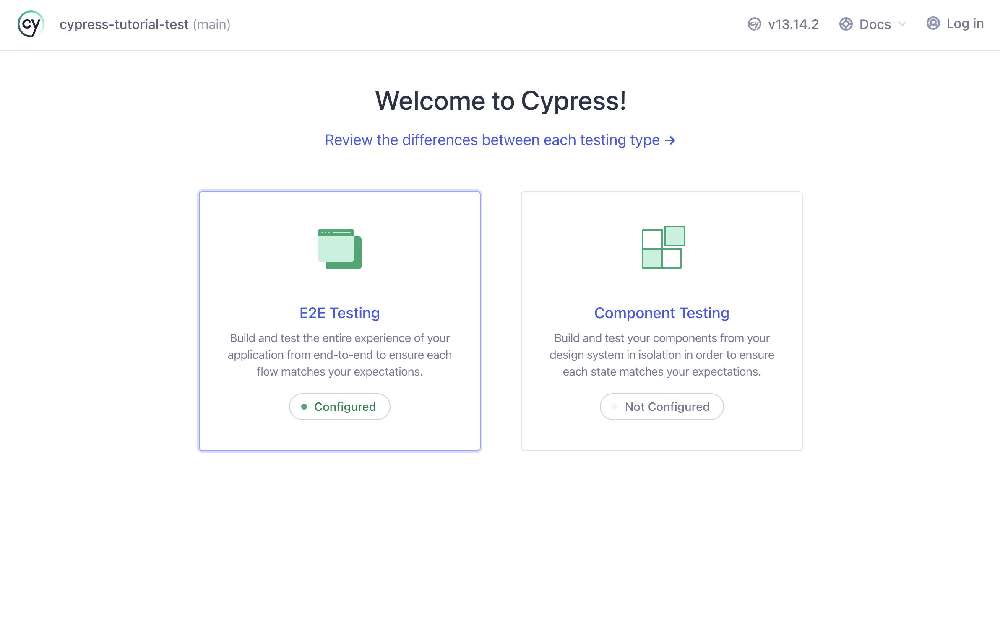
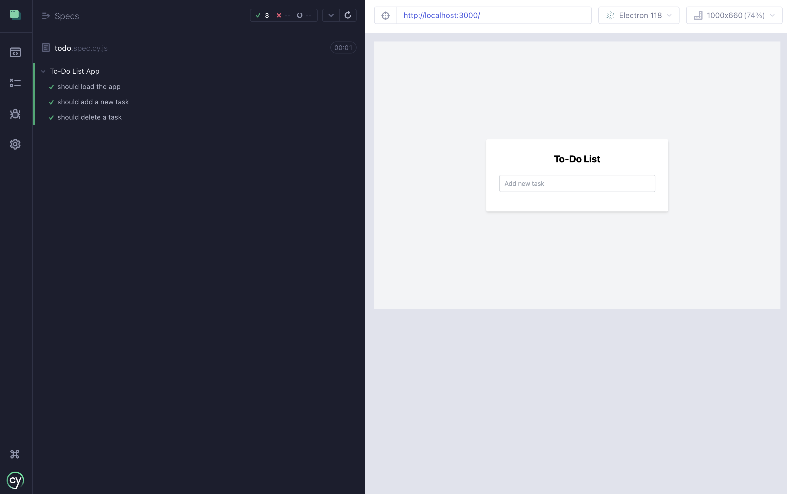
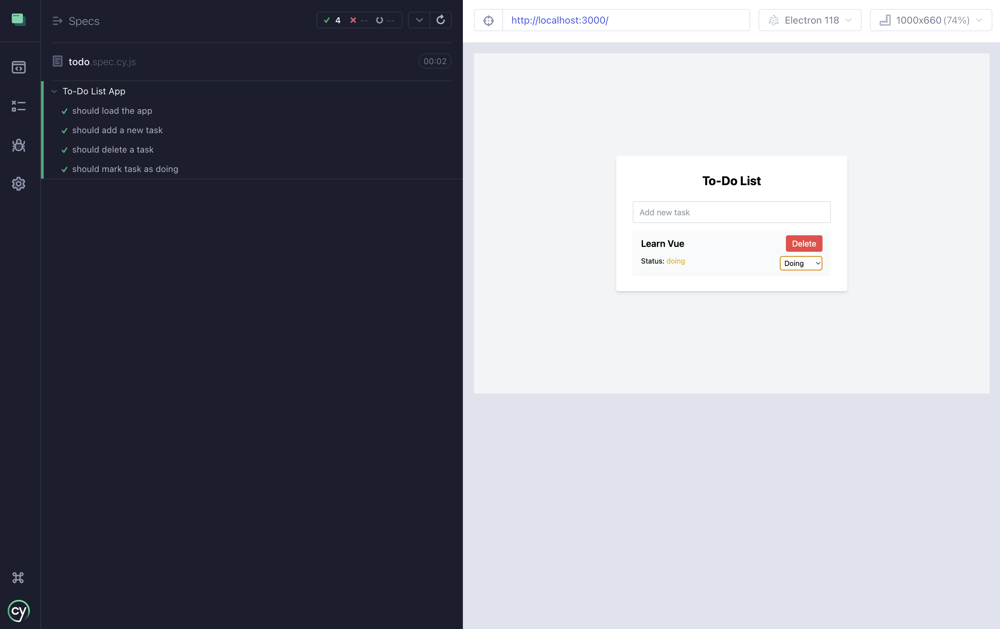

# Testing Vue with Cypress (Part 2: Setup Cypress)

This is a step-by-step guide to use **Vue.js** to set up a To-Do List application and then test it with **Cypress**.

In this part, we will add Cypress to our Vue.js project for front-end testing.

### Step 1: Install Cypress

1. **Install Cypress as a development dependency** in your Vue.js project:

   ```bash
   npm install cypress --save-dev
   ```

2. **Initialize Cypress** by running the following command:

   ```bash
   npx cypress open
   ```

   This will open the Cypress Test Runner for the first time. Follow the instructions for E2E testing, which will
   create a `cypress/` folder and a `cypress.json` configuration file in your project. The `cypress/` folder contains
   example tests that you can delete later.

   

3. Once Cypress is opened, close it for now. We'll return to writing tests after setting up the project.

### Step 2: Configure Cypress for Your Vue.js Project

Now that Cypress is installed, you can configure it to run tests for your Vue.js app.

1. **Modify `package.json`** to add a script for running Cypress:

   In the `package.json`, add the following script to the `scripts` section:

   ```json
   "scripts": {
     // ...
     "test:e2e": "cypress open"
   }
   ```

   This allows you to run Cypress using `npm run test:e2e`.


2. **Set up Cypress to point to the development server**:

   Open `cypress.config.js` or create it if it's not there (this is used in Cypress 10+).

   ```javascript
   const { defineConfig } = require("cypress");

   module.exports = defineConfig({
     e2e: {
       baseUrl: "http://localhost:3000",
       supportFile: false,
     },
   });
   ```

   This tells Cypress to point to `http://localhost:3000`, where your Vue.js app will be running during tests.

### Step 3: Write a Cypress Test for the To-Do List

Now let's write some end-to-end tests for your To-Do List app.

1. **Create a new test file** inside the `cypress/e2e/` folder. For example, name it `todo.spec.cy.js`:

   ```bash
   mkdir -p cypress/e2e/ 
   touch cypress/e2e/todo.spec.cy.js
   ```

2. **Write the Cypress test** for basic To-Do List functionality:

   We will write three tests for our application.

   - Tests are grouped by a `describe` block, which is the first thing we will add.
   ```javascript
   describe('To-Do List App', () => {
     // Tests will go here...
   });
   ```
   - We can then add a `beforeEach` clause, which will run before each test inside the describe block.
   
   ```javascript
   describe('To-Do List App', () => {
     beforeEach(() => {
       // Before each test, visit the app
       cy.visit('/');
     });
     // Tests will go here...
   });
   ```
   - We can now run the actual tests using the `it` clauses. The description of each `it` clause tells us what the test is checking for. 
     - First, we will check if the app loads:
       ```javascript
       it('should load the app', () => {
         // Check if the app loads with the correct title
         cy.contains('To-Do List').should('be.visible');
       });
       ```
     - Second, we will check if we can add a task:
       ```javascript
       it('should add a new task', () => {
         // Type a task into the input and press Enter
         cy.get('input[placeholder="Add new task"]').type('Learn Cypress{enter}');

         // Check if the new task is added
         cy.contains('Learn Cypress').should('be.visible');
       });
       ```
     - Third, we will check if we can delete a task:
       ```javascript
       it('should delete a task', () => {
         // Add a new task
         cy.get('input[placeholder="Add new task"]').type('Learn Cypress{enter}');

         // Check if the task exists
         cy.contains('Learn Cypress').should('be.visible');

         // Click the delete button for the task
         cy.contains('Learn Cypress')
           .parent()
           .find('button')
           .contains('Delete')
           .click();

         // Verify that the task is deleted
         cy.contains('Learn Cypress').should('not.exist');
       }); 
       ```
   - In the end our `todo.spec.cy.js` file should look as follows:
   ```javascript
   describe('To-Do List App', () => {
     beforeEach(() => {
       // Before each test, visit the app
       cy.visit('/');
     });

     it('should load the app', () => {
       // Check if the app loads with the correct title
       cy.contains('To-Do List').should('be.visible');
     });

     it('should add a new task', () => {
       // Type a task into the input and press Enter
       cy.get('input[placeholder="Add new task"]').type('Learn Cypress{enter}');

       // Check if the new task is added
       cy.contains('Learn Cypress').should('be.visible');
     });

     it('should delete a task', () => {
       // Add a new task
       cy.get('input[placeholder="Add new task"]').type('Learn Cypress{enter}');

       // Check if the task exists
       cy.contains('Learn Cypress').should('be.visible');

       // Click the delete button for the task
       cy.contains('Learn Cypress')
         .parent()
         .find('button')
         .contains('Delete')
         .click();

       // Verify that the task is deleted
       cy.contains('Learn Cypress').should('not.exist');
     });
   });
   ```

#### Recap: Explanation of the Cypress Tests

1. **`beforeEach()`**: This is a hook that runs before each test, ensuring that the app is loaded and ready for the tests to run.

2. **Test 1: App Load Test**: The first test checks if the app loads correctly by checking if the title "To-Do List" is visible.

3. **Test 2: Add Task**: This test types a new task into the input field and presses the `Enter` key to submit. After that, it checks if the new task is added and visible on the page.

4. **Test 3: Delete Task**: This test adds a task, clicks the delete button, and checks if the task is removed from the DOM.

### Step 4: Run Cypress Tests

1. **Start your Vue.js app** by running the development server:

   ```bash
   npm run serve -- --port 3000
   ```

2. **Run Cypress**:

   In another terminal window, run the following command to open the Cypress Test Runner:

   ```bash
   npm run test:e2e
   ```

   - Cypress will launch its UI.
   - Click on E2E and then you'll see the `todo.spec.cy.js` file.
   - Click on the test file to run the tests.


3. **Observe Cypress in Action**: Cypress will run through the test cases, automatically opening your browser and interacting with your Vue.js app, adding tasks, updating statuses, and deleting tasks.

   

### Step 5: Adding the `data-cy` Attribute

We will now make our tests more robust using the `data-cy` attribute in your components.
Using the data-cy attribute is a good practice when writing tests with Cypress because it helps create more robust selectors that are less likely to break when the UI changes.
Let's update the test for changing the status of a task so that it uses the `data-cy` attribute instead of relying on the text or element structure.

1. Add `data-cy` Attributes to the Vue Component:

   First, we need to update the Vue component (`App.vue`) to include data-cy attributes for elements involved in changing the task status.
   Below you will find the `<template>` part of the `App.vue` file with data-cy attributes added.
   You can replace that part of your `App.vue` file.

   ```vue
      <template>
        <div class="min-h-screen bg-gray-100 flex items-center justify-center text-black">
          <div class="bg-white p-8 rounded shadow-md w-full max-w-md">
            <h1 class="text-2xl font-bold mb-6 text-center" data-cy="todo-title">To-Do List</h1>
      
            <!-- Input for new task -->
            <div class="mb-4">
              <input
                  v-model="newTask"
                  @keyup.enter="addTask"
                  placeholder="Add new task"
                  class="w-full px-3 py-2 border border-gray-300 rounded"
                  data-cy="new-task-input"
              />
            </div>
      
            <!-- Task list -->
            <ul class="space-y-3">
              <li
                  v-for="(task, index) in tasks"
                  :key="index"
                  class="flex flex-col justify-between items-start bg-gray-50 px-4 py-2 rounded shadow-sm"
                  :data-cy="'task-item-' + index"
              >
                <!-- Task title and status -->
                <div class="w-full flex justify-between items-center">
                  <span class="text-lg font-semibold" :data-cy="'task-text-' + index">{{ task.text }}</span>
      
                  <!-- Delete button -->
                  <button
                      @click="removeTask(index)"
                      class="bg-red-500 text-white px-3 py-1 rounded hover:bg-red-600"
                      :data-cy="'delete-task-' + index"
                  >
                    Delete
                  </button>
                </div>
      
                <!-- Dropdown to change task status -->
                <div class="flex justify-between w-full mt-2">
                  <span class="text-sm" :data-cy="'task-status-' + index">Status:
                  <span :class="{
                    'text-red-500': task.status === 'pending',
                    'text-yellow-500': task.status === 'doing',
                    'text-green-500': task.status === 'done'
                  }">{{ task.status }}</span>
                  </span>
                  <select
                      v-model="task.status"
                      @change="saveTasks"
                      class="border rounded p-1 text-sm"
                      :data-cy="'status-select-' + index"
                  >
                    <option value="pending">Pending</option>
                    <option value="doing">Doing</option>
                    <option value="done">Done</option>
                  </select>
                </div>
              </li>
            </ul>
          </div>
        </div>
      </template>
   ```

2. Update Cypress Test to Use data-cy
   Now that we have added the data-cy attributes, let's update the Cypress test to select elements using these attributes.
   Here's the updated test in `cypress/e2e/todo.spec.cy.js`:

   ```javascript
   describe('To-Do List App', () => {
     beforeEach(() => {
       // Before each test, visit the app
       cy.visit('/');
     });
   
     it('should load the app', () => {
       // Check if the app loads with the correct title
       cy.get('[data-cy="todo-title"]').should('be.visible');
     });
   
     it('should add a new task', () => {
       // Type a task into the input and press Enter
       cy.get('[data-cy="new-task-input"]').type('Learn Cypress{enter}');
   
       // Check if the new task is added
       cy.get('[data-cy="task-text-0"]').should('contain', 'Learn Cypress');
     });
   
     it('should delete a task', () => {
       // Add a new task
       cy.get('[data-cy="new-task-input"]').type('Learn Cypress{enter}');
   
       // Check if the task exists
       cy.get('[data-cy="task-text-0"]').should('contain', 'Learn Cypress');
   
       // Click the delete button for the task
       cy.get('[data-cy="delete-task-0"]').click();
   
       // Verify that the task is deleted
       cy.get('[data-cy="task-text-0"]').should('not.exist');
     });
   });
   ```

3. We can now easily add more complex tests. 
   For example, the test below allows us to check whether we can update a task's status.
   You can add it to the describe block in `todo.spec.cy.js`.

   ```javascript
   
     it('should mark task as doing', () => {
       // Add a new task
       cy.get('[data-cy="new-task-input"]').type('Learn Vue{enter}');
   
       // Select "doing" from the dropdown
       cy.get('[data-cy="status-select-0"]').select('doing');
   
       // Verify that the task status is updated
       cy.get('[data-cy="task-status-0"]').should('contain', 'Status: doing');
     });
   ```

   

---

Now you have Cypress fully integrated into your Vue.js project, allowing you to write end-to-end tests for your To-Do List app.
You can test UI interactions, task management, and other features to ensure the robustness of your front-end code.
In the next section, we will mock API calls using spies, stubs, and mocks.
