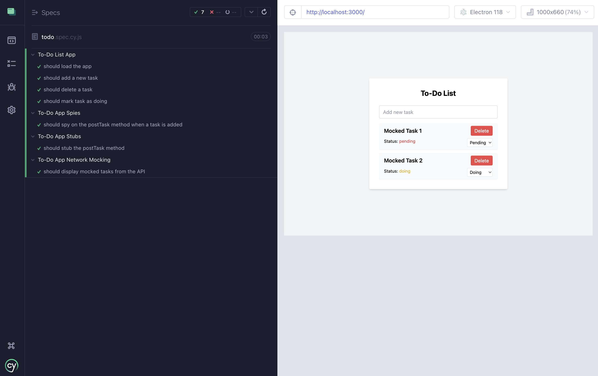

# Testing Vue with Cypress (Part 3: Adding Spies, Stubs, and Mocks)

This is a step-by-step guide to use **Vue.js** to set up a To-Do List application and then test it with **Cypress**.

In this part, we will guide you through adding **spies**, **stubs**, **mocks**, and **network intercepts** to your existing Vue.js To-Do app using Cypress.
We'll cover how to test interactions and simulate network requests, focusing on techniques like spying on functions, stubbing and mocking methods, and intercepting HTTP requests.

## Step 1: Adding Spies in Cypress

**Spies** are used to track calls to a particular function, including how many times the function was called and with what arguments.

Let's assume we have a function in the To-Do app that sends each task addition to a backend API (`postTask`).
For our intents and purposes, this method will only log to the console, but you can imagine that it actually sends some important data back to a remote API.
We will spy on that method.

1. **Modify the To-Do App to include a method to spy on**:

   In your `App.vue`, add an API method (`postTask`) and modify the `addTask` method to call `postTask`:

   ```javascript
   export default {
     // ...
     methods: {
       // ...
       addTask() {
         if (this.newTask.trim()) {
           // Add the new task with default status of 'pending'
           this.tasks.push({
             text: this.newTask,
             status: 'pending'
           });
           this.postTask(this.newTask);
           this.newTask = '';
           this.saveTasks();
         }
       },
       postTask(task) {
         console.log(`Task added: ${task}`);
         // sends task to api...
       },
       // ...
     }
   };
   ```

   The `postTask` method logs the task to the console and we will spy on this method in Cypress.


2. **Create a test to spy on the `postTask` method**:

   In your Cypress test folder (`cypress/e2e`), add a new `describe` block to your `todo.spec.cy.js`:

   ```javascript
   describe('To-Do App Spies', () => {
      beforeEach(() => {
         cy.visit('/');
      });

      it('should spy on the postTask method when a task is added', () => {
        // Access the Vue instance and spy on the logTaskAdded method
        cy.window().then((win) => {
            cy.spy(win.__app__, 'postTask').as('postTaskSpy');
        });

        // Add a new task
        cy.get('[data-cy="new-task-input"]').type('Learn Cypress{enter}');

        // Assert that the spy was called with the task
        cy.get('@postTaskSpy').should('have.been.calledWith', 'Learn Cypress');
      });
   });
   ```

### Explanation

- **`cy.spy()`**: We create a spy for the `postTask` method and alias it as `postTaskSpy`.
- **Assertions**: After adding a new task, we check that the `postTask` method was called with the correct argument using `.should('have.been.calledWith')`.

## Step 2: Adding Stubs in Cypress

**Stubs** allow you to replace a method's implementation and control its behavior during testing.
For example, if the `postTask` function sends data to an *external* API, we might not want to actually send that data during testing.
Instead, we’ll stub it.

1. **Create a test with stubbing**:

   In `todo.spec.cy.js`, add a new `describe` block for stubbing:

   ```javascript
   describe('To-Do App Stubs', () => {
      beforeEach(() => {
        cy.visit('/');
      });

      it('should stub the postTask method', () => {
        // Access the Vue instance and stub the logTaskAdded method
        cy.window().then((win) => {
            cy.stub(win.__app__, 'postTask').as('postTaskStub');
        });

        // Add a new task
        cy.get('[data-cy="new-task-input"]').type('Learn Stubbing{enter}');

        // Assert that the stub was called with the task
        cy.get('@postTaskStub').should('have.been.calledWith', 'Learn Stubbing');
      });
   });
   ```

### Explanation

- **`cy.stub()`**: We use `cy.stub()` to replace the `postTask` method’s implementation with a stub, preventing the actual sending (and logging) action while keeping track of its calls.


## Step 3: Mocking Requests with `Cypress.sinon.mock`

Now let's learn how to mock network requests or service methods using `Cypress.sinon.mock`. This is particularly useful when you want to isolate specific behaviors or simulate external API responses without making actual network requests.

Suppose your To-Do app has a service that interfaces with an API. We will mock the API response using Sinon's mocking capabilities integrated with Cypress.

### 1. Create an `apiService` Module

Add a new `apiService.js` file in the `src/services/` directory with the following contents:

```javascript
// src/services/apiService.js

const apiService = {
  patchTask(taskId, updates) {
    console.log(`Patching task with ID ${taskId}:`, updates);
  },

  putTask(task) {
    console.log(`Putting task:`, task);
  },
};

export default apiService;
```

This module provides two methods:
- **`patchTask`**: Simulates a partial update to a task.
- **`putTask`**: Simulates replacing or updating the entire task object.

For now, they only log some content, but you will mock them in Cypress for testing purposes.

### 2. Use `apiService` in Your Vue Component

You can now use the `apiService` methods in your Vue component where tasks are managed. For example, you might call `patchTask` when editing the status of a task.

In `App.vue`:

```javascript
import apiService from './services/apiService';

export default {
  // ...
  methods: {
    // ...
      updateTaskStatus(taskId, status) {
          apiService.patchTask(taskId, { status });
      },
      updateTask(task) {
          apiService.putTask(task);
      },
  },
};
```

Here, `patchTask` is used to update the status of a task, and `putTask` is used to replace an entire task.

---

### 3. Create a Cypress Test for Mocking

In `cypress/e2e/todo.spec.cy.js`, add the test for mocking the `patchTask` and `putTask` methods.

```javascript
import apiService from '../../src/services/apiService';

// ...

describe('To-Do App Mocks with apiService', () => {
    beforeEach(() => {
        cy.visit('/');
    });

    it('should mock the patchTask method to verify invocation', () => {
        // Create a Sinon mock for apiService
        const mock = Cypress.sinon.mock(apiService);

        // Define the mock behavior: no return value, just expect it to be called
        const taskId = 123; // Example task ID
        const updates = { status: 'doing' }; // Example updates
        mock.expects('patchTask').once().withArgs(taskId, updates);

        // Simulate calling the patchTask method
        cy.window().then((win) => {
            apiService.patchTask(taskId, updates);
            // Verify that the mock expectations are met
            mock.verify()
            // Restore the original method
            mock.restore();
        });
    });

    it('should mock the putTask method to verify invocation', () => {
        // Create a Sinon mock for apiService
        const mock = Cypress.sinon.mock(apiService);

        // Define the mock behavior: no return value, just expect it to be called
        const task = { id: 123, text: 'Updated Task', status: 'done' }; // Example task object
        mock.expects('putTask').once().withArgs(task);

        // Simulate calling the putTask method
        cy.window().then((win) => {
            apiService.putTask(task);
            // Verify that the mock expectations are met
            mock.verify()
            // Restore the original method
            mock.restore();
        });
    });
});
```

### Explanation

1. **Mocking Methods**:
    - `mock.expects('methodName')` defines expectations for how the method should be invoked.
    - In this case, `patchTask` and `putTask` do not return values, so the test focuses only on verifying the arguments passed to these methods.

2. **Behavior Definitions**:
    - **`mock.expects('patchTask')`**:
        - Ensures `patchTask` is called exactly once with the specified `taskId` and `updates`.
    - **`mock.expects('putTask')`**:
        - Ensures `putTask` is called exactly once with the specified `task` object.

3. **Simulating Calls**:
    - The methods `apiService.patchTask` and `apiService.putTask` are called directly within the test using `cy.window().then()` to maintain Cypress's promise chain.

4. **Verification**:
    - `mock.verify()` confirms that all expectations defined for the mocked method were met (e.g., method was called the correct number of times with the correct arguments).

5. **Restoration**:
    - `mock.restore()` restores the original implementation of `patchTask` and `putTask` to avoid side effects in subsequent tests.

## Step 4: Mocking HTTP Requests with `cy.intercept()`

Now let’s mock network requests. Suppose your To-Do app fetches tasks from an API. We will mock the API response using `cy.intercept()`.

1. **Modify the To-Do App to make an API call**:

In your Vue app, add a `created()` lifecycle hook (after `data()`) to load tasks from an API:

```javascript
export default {
  data() {
    return {
      newTask: '',
      tasks: []
    };
  },
  created() {
    fetch('/api/todos')
      .then(response => response.json())
      .then(data => {
        this.tasks = data;
      });
  },
  methods: {
    // Existing methods...
  }
};
```

2. **Create a Cypress test for intercepting the API request**:

In `todo.spec.cy.js`, add the test for intercepting API requests:

```javascript
describe('To-Do App Network Intercepting', () => {
  beforeEach(() => {
    // Intercept the GET request to /api/todos
    cy.intercept('GET', '/api/todos', {
      statusCode: 200,
      body: [
        { id: 1, text: 'Mocked Task 1', status: 'pending' },
        { id: 2, text: 'Mocked Task 2', status: 'doing' }
      ]
    }).as('getTodos');

    // Visit the app
    cy.visit('/');
  });

  it('should display mocked tasks from the API', () => {
    // Wait for the API call to complete
    cy.wait('@getTodos');

    // Verify the mocked tasks are displayed
    cy.contains('Mocked Task 1').should('be.visible');
    cy.contains('Mocked Task 2').should('be.visible');
  });
});
```

### Explanation

- **`cy.intercept()`**: We mock the API response for the `/api/todos` request, providing a custom response body.
- **`cy.wait()`**: We wait for the API call (`@getTodos`) to complete before making assertions.
- **Assertions**: We assert that the mocked tasks are rendered correctly on the page.





## Step 5: Testing Edge Cases with Spies, Stubs, and Mocks

You can extend the use of **spies**, **stubs**, and **mocks** to test more complex scenarios:

1. **Edge Case for Task Deletion**:
   Use `cy.spy()` to verify that a specific method (e.g., `removeTask`) is called when a task is deleted.

2. **Mock Error Responses**:
   Use `cy.intercept()` to mock an error response from the API, such as a `500` status, and test how your app handles error scenarios.

## Step 6: Debugging and Writing More Tests

You can now easily add more tests and debug interactions in your app. Cypress provides powerful debugging tools, including:
- **Screenshots and videos** of each test.
- **Time travel** to inspect every action taken by Cypress.

## Conclusion

- **Spies**: Use spies to verify that certain functions or methods are being called as expected and track how they are used.
- **Stubs**: Stubs are perfect for replacing functions with custom implementations or preventing side effects (e.g., network requests or logs).
- **Mocks**: `Cypress.sinon.mock()` allows you to create controlled expectations for specific methods of an object, ensuring that they are called the correct number of times, with the correct arguments, and optionally define their behavior during the test, such as returning specific values or triggering side effects.
- **Intercepts**: `cy.intercept()` allows you to intercept network requests and test how your app behaves under different conditions, such as successful responses, errors, and slow networks.

By integrating these techniques into your testing workflow, you can ensure that your app behaves as expected in all scenarios without relying on external APIs or services during your tests.
